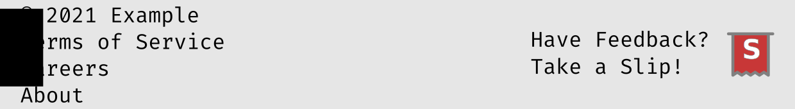

# Style Guide

This style guide provides best practices for the usage of Slip branding on both end-user websites and internal development tools. Since the Slip tracker focuses on showing a friendly interface for issue tracking to end users, our uniform assets and styling can be used to give your users a familiar support experience. While adherance to these guidelines is recommended, other interfaces can be used to redirect your users to the Slip platform.

Guidelines and templates for internal documents are available in  our [Internal Documents Guide](./InternalDocuments.html).

## Colors and Logos

The Slip logos are available as scalable vector files in the assets subdirectory of our [main software repository]({{ site.github.repository_url }}).

An abbreviated logo is provided for unobtrusive use in webpage footers, mobile application sidebars, and conventional help menus:

Example usage:

The full logo is shown when the user navigates to the Slip management portal:

Our branding uses an off-red (#c83737) as the primary color, and a pure gray (#808080) as the accent color. If desired, the accent color can be substituted with an 80% gray or a 20% gray in order to increase contrast with client branding.

### Typefaces

Slip uses the Fira Sans and Fira Code families for formatted text and embedded source code, respectively. When rendering a Slip or related objects, these families are preferred.

When embedding branding into other applications, use the same typeface that is used for other text on similar user interface elements.

The Slip logo itself uses italic 900 variant of the Roboto typeface. 

## Keywords and Language

The Slip platform is centered around the Slip, a unit of data which provides functionality similar to a customer support token or a bug tracker issue. Users can be prompted to "Take a Slip," rather than asking them to file a complaint or report an issue. This phrasing is preferred in communication with users of the service.

